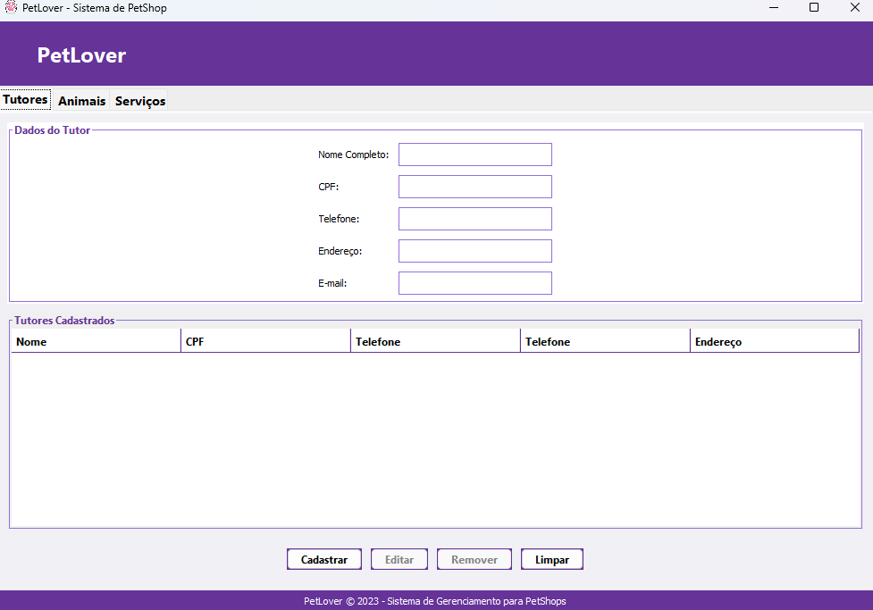
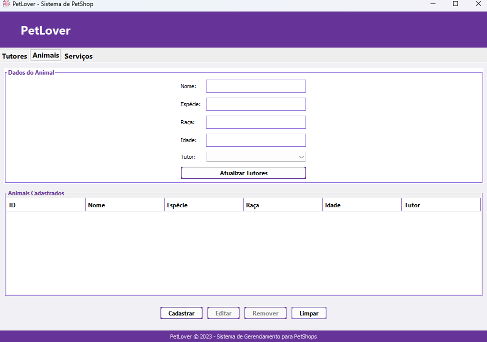
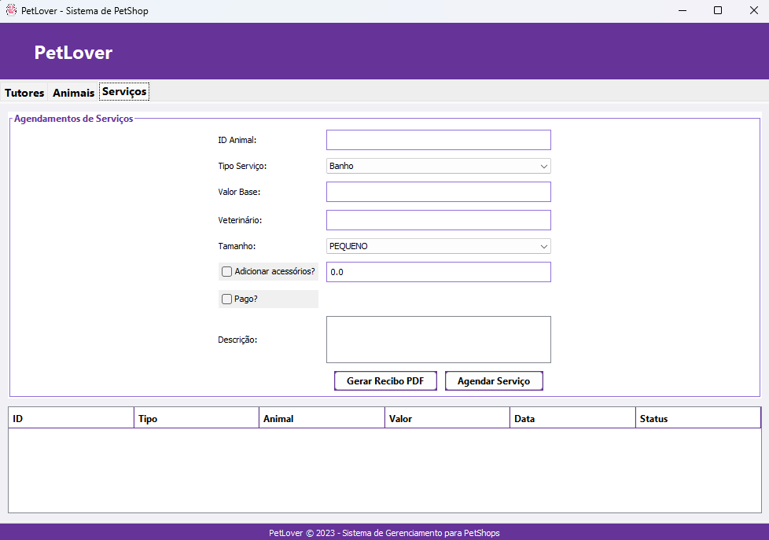

# 🐾 PetLover (Sistema de Gestão para PetShops)

> Projeto acadêmico para gestão de pet shops com interface gráfica em Java Swing.

## 📌 Sobre o Projeto

O **PetLover** é um sistema de gerenciamento para pet shops, feito em **Java para desktop**, utilizando **Java Swing** para a interface gráfica.  
Seu objetivo é facilitar o controle de **animais**, **tutores**, **serviços veterinários** e **emissão de recibos**, otimizando a rotina do pet shop **PetLover**.
Este repositório representa a fase inicial do projeto e ainda está em desenvolvimento.
## 📌 Principais funcionalidades 
1. Cadastrar, buscar, atualizar e remover tutores
2. Cadastrar, buscar, atualizar e remover animais dos respectivos tutores 
3. Listar serviços e serviços pendentes
4. Gerar recibos em PDF 

# Imagens do Sistema 

### 📌 Cadastro de Tutores

### 📌 Cadastro de Animais

### 📌 Gerenciamento de Serviços e Emissão de Recibos

   
## 🛠️ Tecnologias Utilizadas

- **Java 17+**
- **Java Swing (GUI)** (Interface Gráfica)
- **Padrões de Projeto** (Interface, MVC)
- **Apache PDFBox 2.0.27** (Geração de PDFs)
- **JUnit 5** (Testes Unitários)

---

## 🧑‍💻 Como Executar o Projeto

Para rodar o projeto **PetLover** na sua máquina, siga os passos abaixo:

### ✅ Pré-requisitos

- Java JDK **17 ou superior** instalado
- Uma IDE de sua preferência (recomenda-se **IntelliJ IDEA**)
- Git (opcional, para clonar o repositório)
  
